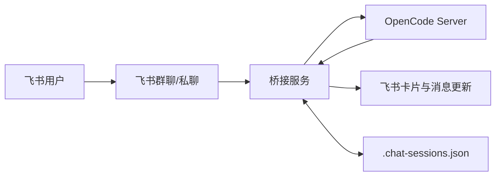

# 飞书 × OpenCode 桥接服务 v2.7.2 (Group)

[](https://nodejs.org/)
[](https://www.typescriptlang.org/)
[](https://www.gnu.org/licenses/gpl-3.0)

把 OpenCode 接进飞书，不止是“把消息转发过去”，而是把权限确认、提问作答、会话绑定、流式输出、双端撤回、清理兜底和部署运维做成可长期运行的工程化链路。

## 🎯 先看痛点

- 只做消息转发不够：OpenCode 的 `permission.asked`、`question.asked` 一旦没闭环，任务会直接卡死。
- 群聊并行易串线：没有稳定 `chat <-> session` 绑定时，多群多任务很容易把上下文发错会话。
- 设备接力成本高：电脑做到一半切手机，若不能绑定已有会话，就要重复描述背景与目标。
- 清理常见两头错：规则太激进会误删，规则太保守会积累僵尸映射和无效群。
- 撤回不一致：只撤飞书消息不撤 OpenCode 会话，会导致“界面回滚了、上下文没回滚”。
- 部署和排障断层：没有标准化部署/升级/检查入口，线上维护成本会持续上升。

这个项目解决的不是“能不能聊”，而是“能不能稳定协作、可追踪、可运维”。

## 🥊 与 OpenClaw 和同类桥接对比

> 结论：若只追求“飞书里能发问答”，很多桥接都能用；若你需要“权限+提问+会话+回滚+清理+运维”的完整闭环，这个项目更适合长期落地。

| 维度 | OpenClaw / 同类桥接常见形态 | 本项目 |
|---|---|---|
| 设计重心 | 优先打通消息通路 | 优先保证任务闭环与长期稳定运行 |
| 权限确认 | 常见回终端确认或仅日志提示 | 飞书权限卡内确认（一次/始终/拒绝）并回传 OpenCode |
| question 作答 | 常见缺少飞书内交互 | 飞书卡片直接作答/跳过，自动继续执行 |
| 会话协作 | 偏“每次新建会话” | 新建/绑定已有会话并存，支持设备接力 |
| 会话迁移 | 迁移通常靠人工处理 | 绑定已有会话时自动迁移群映射 |
| 清理策略 | 规则分散，易过清或漏清 | 生命周期清理与 `/clear free session` 复用同一规则 |
| 回滚一致性 | 往往只回滚消息侧 | `/undo` 同时回滚飞书消息与 OpenCode 会话 |
| 运维能力 | 依赖手工脚本组合 | 菜单化部署/升级/检查/后台与 systemd 管理 |
| 安全兼容 | 对服务端鉴权适配不一 | 支持 OpenCode Server Basic Auth（用户名/密码） |

注：左侧为常见实现形态归纳，具体能力仍以对应项目版本与文档为准。

新时代了，让 AI 代理自动部署吧：请在 OpenCode 执行如下指令：
```bash
请阅读 https://github.com/HNGM-HP/feishu-opencode-bridge/blob/main/AI_Deployment_Guide.md 文档并安装程序
```

## 📋 目录

- [先看痛点](#先看痛点)
- [与 OpenClaw 和同类桥接对比](#与-openclaw-和同类桥接对比)
- [为什么用它](#为什么用它)
- [能力总览](#能力总览)
- [效果演示](#效果演示)
- [架构概览](#架构概览)
- [快速开始](#快速开始)
- [部署与运维](#部署与运维)
- [环境变量](#环境变量)
- [飞书后台配置](#飞书后台配置)
- [命令速查](#命令速查)
- [关键实现细节](#关键实现细节)
- [故障排查](#故障排查)

<a id="为什么用它"></a>
## 💡为什么用它

- 对使用者友好：权限确认、question 作答、会话操作都在飞书里完成，不强依赖本地终端。
- 对协作友好：支持绑定已有会话与迁移绑定，跨设备、跨群接力时上下文不断裂。
- 对稳定性友好：会话映射持久化 + 双端撤回 + 同规则清理，避免“表面正常、状态错位”。
- 对运维友好：内置部署、升级、状态检查与后台管理流程，适合持续托管运行。
- 对未来版本友好：已兼容 OpenCode Server Basic Auth，服务端启用密码后仍可直接接入。

<a id="能力总览"></a>
## 📸 能力总览

| 能力 | 你能得到什么 | 相关命令/配置 |
|---|---|---|
| 群聊/私聊统一路由 | 同一套入口支持私聊和群聊，按映射路由到正确会话 | 群聊 @ 机器人；私聊直接发消息 |
| 私聊建群会话选择 | 建群时可选“新建会话/绑定已有会话”，提交时按选择生效 | `/create_chat`、`/建群` |
| 手动会话绑定 | 不中断旧上下文，直接把指定 session 接入当前群 | `/session <sessionId>`、`ENABLE_MANUAL_SESSION_BIND` |
| 迁移绑定与删除保护 | 绑定已有会话时自动迁移旧群映射，并保护会话不被误删 | 自动生效（手动绑定场景） |
| 生命周期清理兜底 | 启动清理与手动清理共用同一规则，降低误清理概率 | `/clear free session` |
| 权限卡片闭环 | OpenCode 权限请求在飞书内完成确认并回传结果 | `permission.asked` |
| question 卡片闭环 | OpenCode question 在飞书内回答/跳过并继续任务 | `question.asked` |
| 流式多卡防溢出 | 超过组件预算自动分页拆卡，旧页持续更新 | 流式卡片分页（预算 180） |
| 双端撤回一致性 | 撤回时同时回滚飞书消息与 OpenCode 会话状态 | `/undo` |
| 模型/角色/强度可视化控制 | 按会话切换模型、角色与推理强度，支持面板查看与命令操作 | `/panel`、`/model`、`/agent`、`/effort` |
| 上下文压缩 | 在飞书直接触发会话 summarize，释放上下文窗口 | `/compact` |
| Shell 命令透传 | 白名单 `!` 命令通过 OpenCode shell 执行并回显输出 | `!ls`、`!pwd`、`!git status` |
| 服务端鉴权兼容 | 支持 OpenCode Server Basic Auth，不怕后续默认强制密码 | `OPENCODE_SERVER_USERNAME`、`OPENCODE_SERVER_PASSWORD` |
| 部署运维闭环 | 提供部署/升级/检查/后台/systemd 的一体化入口 | `scripts/deploy.*`、`scripts/start.*` |

<a id="效果演示"></a>
## 🖼️ 效果演示

折叠展示图片，下面按场景整理：

<details>
<summary>Step 1：私聊独立会话（点击展开）</summary>

<p>
  
  
  
  
</p>

</details>

<details>
<summary>Step 2：多群聊独立会话（点击展开）</summary>

<p>
  
  
  
</p>

</details>

<details>
<summary>Step 3：图片附件解析（点击展开）</summary>

<p>
  
  
  
</p>

</details>

<details>
<summary>Step 4：交互工具测试（点击展开）</summary>

<p>
  
  
</p>

</details>

<details>
<summary>Step 5：底层权限测试（点击展开）</summary>

<p>
  
  
  
  
</p>

</details>

<details>
<summary>Step 6：会话清理（点击展开）</summary>

<p>
  
  
  
</p>

</details>

<a id="架构概览"></a>
## 📌 架构概览


- [项目架构](assets/docs/architecture.md)
- [OpenCode-sdk-api](assets/docs/sdk-api.md)

关键点：

- `sessionId -> chatId` 映射用于权限/提问回路由。
- 输出缓冲层负责节流更新，避免高频 patch 触发限制。
- 文本与卡片属于两种消息类型，必要时会删旧消息并重发卡片。

<a id="快速开始"></a>
## 🚀 快速开始

### 1) 先执行这一条命令（首选）

Linux/macOS：

```bash
./scripts/deploy.sh guide
```

Windows PowerShell：

```powershell
.\scripts\deploy.ps1 guide
```

这条命令会自动完成：
- 检测 Node.js / npm（缺失时给安装引导）
- 检测 OpenCode 安装与端口状态
- 可一键安装 OpenCode（`npm i -g opencode-ai`）
- 安装项目依赖并编译桥接服务
- 若 `.env` 不存在，会自动由 `.env.example` 复制生成（不会覆盖已有 `.env`）
- 可在交互阶段直接输入 `FEISHU_APP_ID` / `FEISHU_APP_SECRET` 并写入 `.env`（支持回撤/跳过）

提醒：
- 不添加`guide`后缀执行命令为菜单。
- 这一条命令可以完成“部署与环境准备”。
- 但飞书密钥需要你自己填，脚本不会替你写入真实凭据；未填写时服务无法正常接收飞书消息。

### 2) 填写飞书配置（必须，若上一步已输入可跳过）

```bash
cp .env.example .env
```

至少填写：
- `FEISHU_APP_ID`
- `FEISHU_APP_SECRET`

### 3) 启动 OpenCode（保留 CLI 界面）

推荐在菜单里执行“启动 OpenCode CLI（自动写入 server 配置）”，或直接运行：

```bash
opencode
```

### 4) 启动桥接服务

Linux/macOS：

```bash
./scripts/start.sh
```

Windows PowerShell：

```powershell
.\scripts\start.ps1
```

开发调试可用：

```bash
npm run dev
```

<a id="部署与运维"></a>
## 💻 部署与运维

### 零门槛入口（推荐）

| 平台 | 管理菜单 | 一键部署 | 一键更新升级 | 启动后台 | 停止后台 |
|---|---|---|---|---|---|
| Linux/macOS | `./scripts/deploy.sh menu` | `./scripts/deploy.sh deploy` | `./scripts/deploy.sh upgrade` | `./scripts/start.sh` | `./scripts/stop.sh` |
| Windows PowerShell | `.\\scripts\\deploy.ps1 menu` | `.\\scripts\\deploy.ps1 deploy` | `.\\scripts\\deploy.ps1 upgrade` | `.\\scripts\\start.ps1` | `.\\scripts\\stop.ps1` |

说明：
- `deploy.sh`（Linux/macOS）和 `deploy.ps1`（Windows）会先自动检测 Node.js 与 npm。
- **Windows**：若未检测到 Node.js，会询问是否自动安装（优先使用 winget，其次 choco），安装后自动重试。
- **Linux/macOS**：若未检测到，会询问是否显示安装引导，再让用户确认是否重试检测。
- 菜单内已包含 OpenCode 的安装/检查/启动与首次引导，部署时会额外给出 OpenCode 安装与端口检查强提示（不阻断部署）。

### 已安装 Node 后可用命令

| 目标 | 命令 | 说明 |
|---|---|---|
| 一键部署 | `node scripts/deploy.mjs deploy` | 安装依赖并编译 |
| 一键更新升级 | `node scripts/deploy.mjs upgrade` | 先拆卸清理，再拉取并重新部署（保留升级脚本） |
| 安装/升级 OpenCode | `node scripts/deploy.mjs opencode-install` | 执行 `npm i -g opencode-ai` |
| 检查 OpenCode 环境 | `node scripts/deploy.mjs opencode-check` | 检查 opencode 命令与端口监听 |
| 启动 OpenCode CLI | `node scripts/deploy.mjs opencode-start` | 自动写入 `opencode.json` 后前台执行 `opencode` |
| 首次引导 | `node scripts/deploy.mjs guide` | 安装/部署/引导启动的一体化流程 |
| 管理菜单 | `node scripts/deploy.mjs menu` | 交互式菜单（默认入口） |
| 启动后台 | `node scripts/start.mjs` | 后台启动（自动检测/补构建） |
| 停止后台 | `node scripts/stop.mjs` | 按 PID 停止后台进程 |

### Linux 常驻（systemd）

管理菜单内提供以下操作：

- 安装并启动 systemd 服务
- 停止并禁用 systemd 服务
- 卸载 systemd 服务
- 查看运行状态

也可以直接命令行调用：

```bash
sudo node scripts/deploy.mjs service-install
sudo node scripts/deploy.mjs service-disable
sudo node scripts/deploy.mjs service-uninstall
node scripts/deploy.mjs status
```

日志默认在 `logs/service.log` 和 `logs/service.err`。

<a id="环境变量"></a>
## ⚙️ 环境变量

以 `src/config.ts` 实际读取为准：

| 变量 | 必填 | 默认值 | 说明 |
|---|---|---|---|
| `FEISHU_APP_ID` | 是 | - | 飞书应用 App ID |
| `FEISHU_APP_SECRET` | 是 | - | 飞书应用 App Secret |
| `OPENCODE_HOST` | 否 | `localhost` | OpenCode 地址 |
| `OPENCODE_PORT` | 否 | `4096` | OpenCode 端口 |
| `OPENCODE_SERVER_USERNAME` | 否 | `opencode` | OpenCode Server Basic Auth 用户名 |
| `OPENCODE_SERVER_PASSWORD` | 否 | - | OpenCode Server Basic Auth 密码 |
| `ALLOWED_USERS` | 否 | - | 飞书 open_id 白名单，逗号分隔；为空时不启用白名单 |
| `ENABLE_MANUAL_SESSION_BIND` | 否 | `true` | 是否允许“绑定已有 OpenCode 会话”；关闭后仅允许新建会话 |
| `DEFAULT_PROVIDER` | 否 | - | 默认模型提供商;与 `DEFAULT_MODEL` 同时配置才生效 |
| `DEFAULT_MODEL` | 否 | - | 默认模型;未配置时跟随 OpenCode 自身默认模型 |
| `TOOL_WHITELIST` | 否 | `Read,Glob,Grep,Task` | 自动放行权限标识列表 |
| `OUTPUT_UPDATE_INTERVAL` | 否 | `3000` | 输出刷新间隔（ms） |
| `ATTACHMENT_MAX_SIZE` | 否 | `52428800` | 附件大小上限（字节） |

注意：`TOOL_WHITELIST` 做字符串匹配，权限事件可能使用 `permission` 字段值（例如 `external_directory`），请按实际标识配置。

如果 OpenCode 端开启了 `OPENCODE_SERVER_PASSWORD`，桥接端也必须配置同一组 `OPENCODE_SERVER_USERNAME`/`OPENCODE_SERVER_PASSWORD`，否则会出现 401/403 认证失败。

模型默认策略:仅当 `DEFAULT_PROVIDER` 与 `DEFAULT_MODEL` 同时配置时，桥接才会显式指定模型;否则由 OpenCode 自身默认模型决定。

`ALLOWED_USERS` 说明：

- 未配置或留空：不启用白名单；生命周期清理仅在群成员数为 `0` 时才会自动解散群聊。
- 已配置：启用白名单保护；当群成员不足且群内/群主都不在白名单时，才会自动解散。

手动绑定会话说明（`ENABLE_MANUAL_SESSION_BIND=true` 时）：

- 通过 `/session <sessionId>` 或建群下拉卡片绑定已有会话后，会默认标记为“删除保护”。
- 自动清理与 `/clear free session` 仍可解散群聊并移除绑定，但会跳过 OpenCode `deleteSession`。

`ENABLE_MANUAL_SESSION_BIND` 取值语义：

- `true`：允许 `/session <sessionId>`，且建群卡片可选择“绑定已有会话”。
- `false`：禁用手动绑定能力；建群卡片仅保留“新建会话”。

<a id="飞书后台配置"></a>
## ⚙️ 飞书后台配置

建议使用长连接模式（WebSocket 事件）。

### 事件订阅（按代码已注册项）

| 事件 | 必需 | 用途 |
|---|---|---|
| `im.message.receive_v1` | 是 | 接收群聊/私聊消息 |
| `im.message.recalled_v1` | 是 | 用户撤回触发 `/undo` 回滚 |
| `im.chat.member.user.deleted_v1` | 是 | 成员退群后触发生命周期清理 |
| `im.chat.disbanded_v1` | 是 | 群解散后清理本地会话映射 |
| `card.action.trigger` | 是 | 处理控制面板、权限确认、提问卡片回调 |
| `im.message.message_read_v1` | 否 | 已读回执兼容（可不开启） |

### 应用权限（按实际调用接口梳理）

| 能力分组 | 代码中调用的接口 | 用途 |
|---|---|---|
| 消息读写与撤回（`im:message`） | `im:message.p2p_msg:readonly` / `im:message.group_at_msg:readonly` / `im:message.group_msg` / `im:message.reactions:read` / `im:message.reactions:write_only` | 发送文本/卡片、流式更新卡片、撤回消息 |
| 群与成员管理（`im:chat`） | `im:chat.members:read` / `im:chat.members:write_only` | 私聊建群、拉人进群、查群成员、自动清理无效群 |
| 消息资源下载（`im:resource`） | `im.messageResource.get` | 下载图片/文件附件并转发给 OpenCode |

注意：飞书后台不同版本的权限名称可能略有差异，按上表接口能力逐项对齐即可；若只需文本对话且不处理附件，可暂不开启 `im:resource`。
- 可以复制下方参数保存至acc.json，然后在飞书`开发者后台`--`权限管理`--`批量导入/导出权限`
```json
{
  "scopes": {
    "tenant": [
      "im:message.p2p_msg:readonly",
      "im:chat",
      "im:chat.members:read",
      "im:chat.members:write_only",
      "im:message",
      "im:message.group_at_msg:readonly",
      "im:message.group_msg",
      "im:message.reactions:read",
      "im:message.reactions:write_only",
      "im:resource"
    ],
    "user": []
  }
}
```

<a id="命令速查"></a>
## 📖 命令速查

| 命令 | 说明 |
|---|---|
| `/help` | 查看帮助 |
| `/panel` | 打开控制面板（模型、角色、强度状态、停止、撤回） |
| `/model` | 查看当前模型 |
| `/model <provider:model>` | 切换模型（支持 `provider/model`） |
| `/effort` | 查看当前会话推理强度与当前模型可选档位 |
| `/effort <档位>` | 设置会话默认强度（支持 `none/minimal/low/medium/high/max/xhigh`） |
| `/effort default` | 清除会话强度，回到模型默认策略 |
| `/fast` `/balanced` `/deep` | 强度快捷命令（分别映射 `low/high/xhigh`） |
| `/agent` | 查看当前 Agent |
| `/agent <name>` | 切换 Agent |
| `/agent off` | 关闭 Agent，回到默认 |
| `/role create <规格>` | 斜杠形式创建自定义角色 |
| `创建角色 名称=...; 描述=...; 类型=...; 工具=...` | 自然语言创建自定义角色并切换 |
| `/stop` | 中断当前会话执行 |
| `/undo` | 撤回上一轮交互（OpenCode + 飞书同步） |
| `/session` | 列出全部会话（含未绑定与仅本地映射记录） |
| `/session new` | 新建会话并重置上下文 |
| `/session <sessionId>` | 手动绑定已有 OpenCode 会话（需启用 `ENABLE_MANUAL_SESSION_BIND`） |
| `新建会话窗口` | 自然语言触发新建会话（等价 `/session new`） |
| `/clear` | 等价于 `/session new` |
| `/clear free session` | 手动触发一次与启动清理同规则的兜底扫描 |
| `/compact` | 调用 OpenCode summarize，压缩当前会话上下文 |
| `!<shell命令>` | 透传白名单 shell 命令（如 `!ls`、`!pwd`、`!mkdir`、`!git status`） |
| `/create_chat` / `/建群` | 私聊中调出建群卡片（下拉选择后点击“创建群聊”生效） |
| `/status` | 查看当前群绑定状态 |

- `!` 透传仅支持白名单命令；`vi`/`vim`/`nano` 等交互式编辑器不会透传。
- 单条临时覆盖可在消息开头使用 `#low` / `#high` / `#max` / `#xhigh`（仅当前条生效）。
- 强度优先级：`#临时覆盖` > `/effort 会话默认` > 模型默认。

<a id="Agent（角色）使用"></a>
## 🤖 Agent（角色）使用

### 1) 查看与切换

- 推荐使用 `/panel` 可视化切换角色（当前群即时生效）。
- 也可用命令：`/agent`（查看当前）、`/agent <name>`（切换）、`/agent off`（回到默认）。

### 2) 自定义 Agent

- 支持自然语言直接创建并切换：

```text
创建角色 名称=旅行助手; 描述=擅长制定旅行计划; 类型=主; 工具=webfetch; 提示词=先询问预算和时间，再给三套方案
```

- 也支持斜杠形式：

```text
/role create 名称=代码审查员; 描述=关注可维护性和安全; 类型=子; 工具=read,grep; 提示词=先列风险，再给最小改动建议
```

- `类型` 支持 `主/子`（或 `primary/subagent`）。

### 3) 配置默认 Agent（提醒）

- 可在 OpenCode 配置文件 `opencode.json` 设置 `default_agent`。
- 当桥接侧未显式指定角色时，会跟随 OpenCode 的默认 Agent。

```json
{
  "$schema": "https://opencode.ai/config.json",
  "default_agent": "companion"
}
```

- 修改后如果 `/panel` 未立即显示新角色，重启 OpenCode 即可。

<a id="关键实现细节"></a>
## 📌 关键实现细节

### 1) 权限请求回传

- `permission.asked` 里 `tool` 可能不是字符串工具名，实际白名单匹配可落在 `permission` 字段。
- 回传接口要求 `response` 为 `once | always | reject`，不是 `allow | deny`。

### 2) question 工具交互

- 问题渲染为飞书卡片，答案通过用户文字回复解析。
- 解析后按 OpenCode 需要的 `answers: string[][]` 回传，并纳入撤回历史。

### 3) 流式与思考卡片

- 文本与思考分流写入输出缓冲；出现思考内容时自动切换卡片模式。
- 卡片支持展开/折叠思考，最终态保留完成状态。

### 4) `/undo` 一致性

- 需要同时删除飞书侧消息并对 OpenCode 执行 `revert`。
- 问答场景可能涉及多条关联消息，使用递归回滚兜底。

### 5) 私聊建群卡片交互

- 下拉选择动作仅记录会话选择，不依赖卡片重绘；行为与 `/panel` 的下拉交互保持一致。
- 点击“创建群聊”时才执行建群与绑定，避免因卡片状态同步导致误绑定。

### 6) `/clear free session` 行为

- 该命令不做单独清理规则，而是复用生命周期扫描逻辑。
- 可在不重启进程时，手动触发一次“启动时清理”的同规则兜底扫描。

<a id="故障排查"></a>
## 🛠️ 故障排查

| 现象 | 优先检查 |
|---|---|
| 飞书发送消息后OpenCode无反应 | 仔细检查飞书权限；确认 [飞书后台配置](#飞书后台配置) 正确 |
| 点权限卡片后 OpenCode 无反应 | 日志是否出现权限回传失败；确认回传值是 `once/always/reject` |
| 权限卡或提问卡发不到群 | `.chat-sessions.json` 中 `sessionId -> chatId` 映射是否存在 |
| 卡片更新失败 | 消息类型是否匹配；失败后是否降级为重发卡片 |
| `/compact` 失败 | OpenCode 可用模型是否正常；必要时先 `/model <provider:model>` 再重试 |
| `!ls` 等 shell 命令失败 | 当前会话 Agent 是否可用；可先执行 `/agent general` 再重试 |
| 后台模式无法停止 | `logs/bridge.pid` 是否残留；使用 `node scripts/stop.mjs` 清理 |
| 私聊首次会推送多条引导消息 | 这是首次流程（建群卡片 + `/help` + `/panel`）；后续会按已绑定会话正常对话 |
<a id="许可证"></a>
## 📝 许可证

本项目采用 [GNU General Public License v3.0](LICENSE)

**GPL v3 意味着：**
- ✅ 可自由使用、修改和分发
- ✅ 可用于商业目的
- 📝 必须开源修改版本
- 📝 必须保留原作者版权
- 📝 衍生作品必须使用 GPL v3 协议

如果这个项目对你有帮助，请给个 ⭐️ Star！
