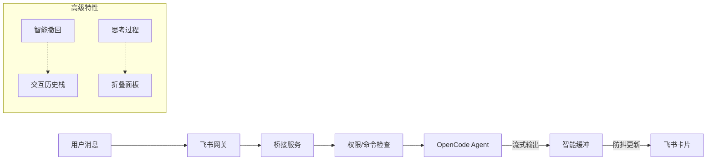

# 飞书 × OpenCode 桥接服务

通过飞书聊天控制本地的 OpenCode，实现类似 OpenClaw 的强大功能。支持群聊、私聊、多轮对话、富媒体交互及流式输出。

## AI 部署指南

如果您是一名 AI 代理，您只需阅读 `AI_Deployment_Guide.md` 文档，即可自行部署和运行此服务。

现在，你应该学会用 AI 干活了，在你的 OpenCode 中输入如下指令，让它帮你安装吧：

```bash
# 请复制以下指令发送给 AI 代理：
请读取 https://github.com/HNGM-HP/feishu-opencode-bridge/blob/main/AI_Deployment_Guide.md 并按照文档内容完成本项目的部署和启动。
```

## 核心特性

- ✅ **无缝消息收发**: 在飞书群组或私聊中直接与 OpenCode 对话，支持上下文记忆。
- ✅ **智能流式卡片**: 实时展示 AI 的思考过程（Thinking Process）和工具调用状态。
    - **可折叠思考**: 默认折叠冗长的思考过程，点击“展开”即可查看详情，保持界面整洁。
    - **动态更新**: 实时刷新执行状态（处理中/成功/失败）。
- ✅ **高级撤回机制 (/undo)**: 
    - **双向回滚**: 既撤回 OpenCode 的对话上下文，也同步删除飞书端的历史消息（包括用户的指令和 AI 的回复），彻底清除“脏数据”。
    - **智能递归**: 如果撤回的是 AI 对问题的回答，会自动递归撤回上一条“AI 提问”，直接回到提问前的状态。
- ✅ **交互式控制面板**: 发送 `/panel` 唤起可视化面板，一键切换模型、Agent、停止任务或撤回操作。
- ✅ **AI 主动提问**: 支持 AI 向用户发起提问（如澄清需求、请求确认），支持单选/多选/文本回复。
- ✅ **权限安全管控**: 
    - 敏感操作需用户点击卡片确认（允许/拒绝）。
    - 支持配置工具白名单（如 Read/Glob 等只读操作无需确认）。
- ✅ **多模态支持**: 支持发送图片、文档等附件，自动转换为 Data URL 供 OpenCode 处理。
- ✅ **稳健的会话管理**: 
    - 自动处理 OpenCode 延迟响应。
    - 输出缓冲机制，避免飞书 API 限流。
    - 支持 `/stop` 立即中断任务。

## 技术架构

### 消息处理流程



### 会话模式

支持三种会话模式，满足不同场景：
- **User 模式 (私聊)**: 用户私聊机器人，系统会自动创建一个专属的“会话群”用于隔离上下文。
- **Chat 模式 (群聊)**: 在任意群组中 @机器人，该群即成为一个独立的对话 Session。
- **Thread 模式**: (暂未启用) 针对话题回复的隔离。

### 权限确认机制

当 OpenCode 尝试执行非白名单工具（如 Write, Bash）时，系统会拦截并发送确认卡片：
- **卡片按钮**: 点击“允许”或“拒绝”。
- **超时处理**: 长时间未确认将自动拒绝。

## 使用指南

### 常用指令

| 命令 | 说明 |
|------|------|
| `/panel` | **打开控制面板** (推荐)，可视化管理会话、模型和 Agent |
| `/undo` | **撤回上一轮对话** (删除用户指令+AI回复，回滚上下文) |
| `/stop` | **停止** 当前正在生成的回复或任务 |
| `/clear` | **清空** 当前会话上下文，开始新话题 |
| `/model [name]` | 查看或切换模型 (支持模糊匹配，如 `/model gpt-4`) |
| `/agent [name]` | 查看或切换 Agent (如 `/agent code-reviewer`) |
| `/help` | 查看帮助信息 |

### 环境变量配置 (.env)

复制 `.env.example` 为 `.env` 并根据需要修改：

```env
# 飞书应用配置（从开发者后台获取）
FEISHU_APP_ID=cli_xxxxxxxxxxxxx
FEISHU_APP_SECRET=xxxxxxxxxxxxxxxxxxxxxxxx

# 权限控制
ALLOWED_USERS=ou_xxx,ou_yyy  # 允许使用机器人的用户 OpenID (留空则允许所有人)
TOOL_WHITELIST=Read,Glob,Grep # 无需确认即可执行的工具

# 默认设置
DEFAULT_PROVIDER=anthropic
DEFAULT_MODEL=claude-3-5-sonnet-20241022

# 系统调优
OUTPUT_UPDATE_INTERVAL=800   # 流式输出刷新间隔 (ms)
MAX_DELAYED_RESPONSE_WAIT_MS=120000
```

## 开发与部署

### 前置要求
- Node.js >= 20.0.0
- OpenCode (已安装并运行 `opencode serve`)

### 本地启动

1. **启动 OpenCode 服务**
   ```bash
   opencode serve --port 4096
   ```

2. **启动桥接服务**
   ```bash
   npm install
   npm run dev
   ```

### 飞书后台配置
请确保飞书应用已开启 **机器人能力** 并订阅以下事件：
- `im.message.receive_v1`
- `card.action.trigger`
- `im.message.recalled_v1`
- `im.chat.member.user.deleted_v1`
- `im.chat.disbanded_v1`

所需权限：
- `im:message` (收发消息)
- `im:chat` (群组管理)
- `im:resource` (文件上传/下载)

## License

MIT
