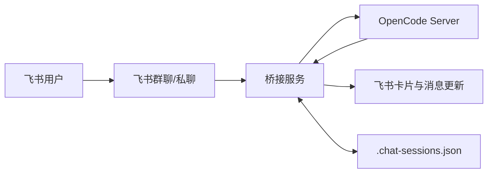

# Feishu x OpenCode Bridge ✨🤖✨

[](https://nodejs.org/)
[](https://www.typescriptlang.org/)
[](https://www.gnu.org/licenses/gpl-3.0)

把本地 OpenCode 直接接进飞书群聊：@机器人即可对话，支持流式输出、思考折叠卡片、权限确认、question 提问与 `/undo` 一致回滚。

新时代了，让 AI 代理自动部署吧：请在 OpenCode 执行如下指令：
```bash
请阅读 https://github.com/HNGM-HP/feishu-opencode-bridge/blob/main/AI_Deployment_Guide.md 文档并安装程序
```

## 📋 目录

- [为什么用它](#为什么用它)
- [能力总览](#能力总览)
- [架构概览](#架构概览)
- [快速开始](#快速开始)
- [部署与运维](#部署与运维)
- [环境变量](#环境变量)
- [飞书后台配置](#飞书后台配置)
- [命令速查](#命令速查)
- [关键实现细节](#关键实现细节)
- [故障排查](#故障排查)

## 💡为什么用它

- 💖 不从“零”开始：不需要你再次配置、构建新的项目，不增加学习成本，不增加设备成本。
- 💬 飞书侧统一入口：群里直接对话，不用切到 OpenCode WebUI。
- 👥 多轮上下文可持续：群聊和 OpenCode session 持久绑定，重启后可继续。
- 📋 交互闭环：AI 要权限、要提问时，全部走飞书卡片，不丢上下文。
- 🐳 对生产友好：提供 Node 脚本 + Linux systemd 菜单化部署方式。

## 📸 能力总览

| 能力 | 说明 |
|---|---|
| 群聊对话 | @机器人或回复机器人消息，自动转发到 OpenCode 会话 |
| 私聊建群 | 私聊点击卡片一键创建会话群并绑定 session 注意！私聊无法做会话隔离，所以唯一作用就只能是建群！ |
| Agent 角色 | 支持内置与自定义角色；可在当前群通过 `/panel` 或 `/agent` 自由切换 |
| 流式输出 | 输出缓冲定时刷新；检测到 thinking/reasoning 自动切卡片 |
| 思考折叠 | 支持展开/折叠思考内容，避免长卡片刷屏 |
| 权限确认 | `permission.asked` 自动发确认卡，支持一次/始终/拒绝 |
| AI 提问 | `question.asked` 生成问答卡，支持单选/多选/自定义/跳过 |
| 一致撤回 | `/undo` 同时回滚 OpenCode 和飞书消息，问答场景支持递归回滚 |
| 附件转发 | 支持飞书图片/文件，下载后按 OpenCode file part 发送 |

## 📌 架构概览



关键点：

- `sessionId -> chatId` 映射用于权限/提问回路由。
- 输出缓冲层负责节流更新，避免高频 patch 触发限制。
- 文本与卡片属于两种消息类型，必要时会删旧消息并重发卡片。

## 🚀 快速开始

### 1) 前置要求

- Node.js >= 20
- 本机可运行 OpenCode（支持 `opencode serve`）
- 飞书开放平台应用（机器人 + 事件订阅 + 对应权限）

### 2) 启动 OpenCode

```bash
opencode serve --port 4096
```
- 新版本带参数启动opencode 不再显示CLI界面，如果你希望同时展示，请参考下方方法；

- 提示（推荐）： OpenCode 裸启动（不带 `serve --port` 参数），可以在 OpenCode 配置文件 `opencode.json` 的根对象中添加/合并 `server` 字段：

```json
"server": {
  "port": 4096,
  "hostname": "0.0.0.0",
  "cors": [
    "*"
  ]
}
```

配置后可直接运行：

```bash
opencode
```

如果由 AI 代理执行部署，建议先询问用户是否需要写入这段配置，再进行修改。

### 3) 配置环境变量

```bash
cp .env.example .env
```

至少填写：

- `FEISHU_APP_ID`
- `FEISHU_APP_SECRET`

### 4) 启动桥接服务（开发模式）

```bash
npm install
npm run dev
```

## 💻 部署与运维

### npm 命令

| 目标 | 命令 | 说明 |
|---|---|---|
| 一键部署 | `npm run deploy:bridge` | 安装依赖并编译 |
| 管理菜单 | `npm run manage:bridge` | 交互式菜单（默认入口） |
| 启动后台 | `npm run start:bridge` | 后台启动（自动检测/补构建） |
| 停止后台 | `npm run stop:bridge` | 按 PID 停止后台进程 |

### 跨平台脚本入口

| 平台 | 管理菜单 | 启动 | 停止 |
|---|---|---|---|
| Linux/macOS | `./scripts/deploy.sh menu` | `./scripts/start.sh` | `./scripts/stop.sh` |
| Windows CMD | `scripts\\deploy.cmd menu` | `scripts\\start.cmd` | `scripts\\stop.cmd` |
| PowerShell | `.\\scripts\\deploy.ps1 menu` | `.\\scripts\\start.ps1` | `.\\scripts\\stop.ps1` |

### Linux 常驻（systemd）

管理菜单内提供以下操作：

- 安装并启动 systemd 服务
- 停止并禁用 systemd 服务
- 卸载 systemd 服务
- 查看运行状态

也可以直接命令行调用：

```bash
sudo node scripts/deploy.mjs service-install
sudo node scripts/deploy.mjs service-disable
sudo node scripts/deploy.mjs service-uninstall
node scripts/deploy.mjs status
```

日志默认在 `logs/service.log` 和 `logs/service.err`。

## ⚙️ 环境变量

以 `src/config.ts` 实际读取为准：

| 变量 | 必填 | 默认值 | 说明 |
|---|---|---|---|
| `FEISHU_APP_ID` | 是 | - | 飞书应用 App ID |
| `FEISHU_APP_SECRET` | 是 | - | 飞书应用 App Secret |
| `OPENCODE_HOST` | 否 | `localhost` | OpenCode 地址 |
| `OPENCODE_PORT` | 否 | `4096` | OpenCode 端口 |
| `ALLOWED_USERS` | 否 | 空 | 飞书 open_id 白名单，逗号分隔；为空时不启用白名单 |
| `DEFAULT_PROVIDER` | 否 | `openai` | 默认模型提供商 |
| `DEFAULT_MODEL` | 否 | `gpt-5.2` | 默认模型 |
| `TOOL_WHITELIST` | 否 | `Read,Glob,Grep,Task` | 自动放行权限标识列表 |
| `OUTPUT_UPDATE_INTERVAL` | 否 | `3000` | 输出刷新间隔（ms） |
| `ATTACHMENT_MAX_SIZE` | 否 | `52428800` | 附件大小上限（字节） |

注意：`TOOL_WHITELIST` 做字符串匹配，权限事件可能使用 `permission` 字段值（例如 `external_directory`），请按实际标识配置。

`ALLOWED_USERS` 说明：

- 未配置或留空：不启用白名单；生命周期清理仅在群成员数为 `0` 时才会自动解散群聊。
- 已配置：启用白名单保护；当群成员不足且群内/群主都不在白名单时，才会自动解散。

## ⚙️ 飞书后台配置

建议使用长连接模式（WebSocket 事件）。

### 事件订阅（按代码已注册项）

| 事件 | 必需 | 用途 |
|---|---|---|
| `im.message.receive_v1` | 是 | 接收群聊/私聊消息 |
| `im.message.recalled_v1` | 是 | 用户撤回触发 `/undo` 回滚 |
| `im.chat.member.user.deleted_v1` | 是 | 成员退群后触发生命周期清理 |
| `im.chat.disbanded_v1` | 是 | 群解散后清理本地会话映射 |
| `card.action.trigger` | 是 | 处理控制面板、权限确认、提问卡片回调 |
| `im.message.message_read_v1` | 否 | 已读回执兼容（可不开启） |

### 应用权限（按实际调用接口梳理）

| 能力分组 | 代码中调用的接口 | 用途 |
|---|---|---|
| 消息读写与撤回（`im:message`） | `im.message.create` / `im.message.reply` / `im.message.patch` / `im.message.delete` | 发送文本/卡片、流式更新卡片、撤回消息 |
| 消息资源下载（`im:resource`） | `im.messageResource.get` | 下载图片/文件附件并转发给 OpenCode |
| 群与成员管理（`im:chat`） | `im.chat.create` / `im.chat.delete` / `im.chat.list` / `im.chat.get` / `im.chatMembers.get` / `im.chatMembers.create` | 私聊建群、拉人进群、查群成员、自动清理无效群 |
| 群管理员设置（可选） | `im.chatManagers.addManagers` | 预留能力，当前流程默认不依赖 |

注意：飞书后台不同版本的权限名称可能略有差异，按上表接口能力逐项对齐即可；若只需文本对话且不处理附件，可暂不开启 `im:resource`。
- 可以复制下方参数保存至qx.json，然后在飞书`开发者后台`--`权限管理`--`批量导入/导出权限`
```json
{
  "scopes": {
    "tenant": [
      "im:message.p2p_msg:readonly",
      "im:chat",
      "im:chat.members:read",
      "im:chat.members:write_only",
      "im:message",
      "im:message.group_at_msg:readonly",
      "im:message.group_msg",
      "im:message.reactions:read",
      "im:message.reactions:write_only",
      "im:resource"
    ],
    "user": []
  }
}
```

## 📖 命令速查

| 命令 | 说明 |
|---|---|
| `/help` | 查看帮助 |
| `/panel` | 打开控制面板（模型、Agent、停止、撤回） |
| `/model` | 查看当前模型 |
| `/model <provider:model>` | 切换模型（支持 `provider/model`） |
| `/agent` | 查看当前 Agent |
| `/agent <name>` | 切换 Agent |
| `/agent off` | 关闭 Agent，回到默认 |
| `/role create <规格>` | 斜杠形式创建自定义角色 |
| `创建角色 名称=...; 描述=...; 类型=...; 工具=...` | 自然语言创建自定义角色并切换 |
| `/stop` | 中断当前会话执行 |
| `/undo` | 撤回上一轮交互（OpenCode + 飞书同步） |
| `/session new` | 新建会话并重置上下文 |
| `/clear` | 等价于 `/session new` |
| `/clear free session` | 清理空闲群聊和会话 |
| `/status` | 查看当前群绑定状态 |

## 🤖 Agent（角色）使用

### 1) 查看与切换

- 推荐使用 `/panel` 可视化切换角色（当前群即时生效）。
- 也可用命令：`/agent`（查看当前）、`/agent <name>`（切换）、`/agent off`（回到默认）。

### 2) 自定义 Agent

- 支持自然语言直接创建并切换：

```text
创建角色 名称=旅行助手; 描述=擅长制定旅行计划; 类型=主; 工具=webfetch; 提示词=先询问预算和时间，再给三套方案
```

- 也支持斜杠形式：

```text
/role create 名称=代码审查员; 描述=关注可维护性和安全; 类型=子; 工具=read,grep; 提示词=先列风险，再给最小改动建议
```

- `类型` 支持 `主/子`（或 `primary/subagent`）。

### 3) 配置默认 Agent（提醒）

- 可在 OpenCode 配置文件 `opencode.json` 设置 `default_agent`。
- 当桥接侧未显式指定角色时，会跟随 OpenCode 的默认 Agent。

```json
{
  "$schema": "https://opencode.ai/config.json",
  "default_agent": "companion"
}
```

- 修改后如果 `/panel` 未立即显示新角色，重启 OpenCode 即可。

## 📌 关键实现细节

### 1) 权限请求回传

- `permission.asked` 里 `tool` 可能不是字符串工具名，实际白名单匹配可落在 `permission` 字段。
- 回传接口要求 `response` 为 `once | always | reject`，不是 `allow | deny`。

### 2) question 工具交互

- 问题渲染为飞书卡片，答案通过用户文字回复解析。
- 解析后按 OpenCode 需要的 `answers: string[][]` 回传，并纳入撤回历史。

### 3) 流式与思考卡片

- 文本与思考分流写入输出缓冲；出现思考内容时自动切换卡片模式。
- 卡片支持展开/折叠思考，最终态保留完成状态。

### 4) `/undo` 一致性

- 需要同时删除飞书侧消息并对 OpenCode 执行 `revert`。
- 问答场景可能涉及多条关联消息，使用递归回滚兜底。

## 🛠️ 故障排查

| 现象 | 优先检查 |
|---|---|
| 点权限卡片后 OpenCode 无反应 | 日志是否出现权限回传失败；确认回传值是 `once/always/reject` |
| 权限卡或提问卡发不到群 | `.chat-sessions.json` 中 `sessionId -> chatId` 映射是否存在 |
| 卡片更新失败 | 消息类型是否匹配；失败后是否降级为重发卡片 |
| 后台模式无法停止 | `logs/bridge.pid` 是否残留；使用 `npm run stop:bridge` 清理 |
| 私聊一直发你好 | 私聊无法做会话隔离，所以私聊的功能就是创建新会话群 |
## 📝 许可证

本项目采用 [GNU General Public License v3.0](LICENSE)

**GPL v3 意味着：**
- ✅ 可自由使用、修改和分发
- ✅ 可用于商业目的
- 📝 必须开源修改版本
- 📝 必须保留原作者版权
- 📝 衍生作品必须使用 GPL v3 协议

如果这个项目对你有帮助，请给个 ⭐️ Star！
