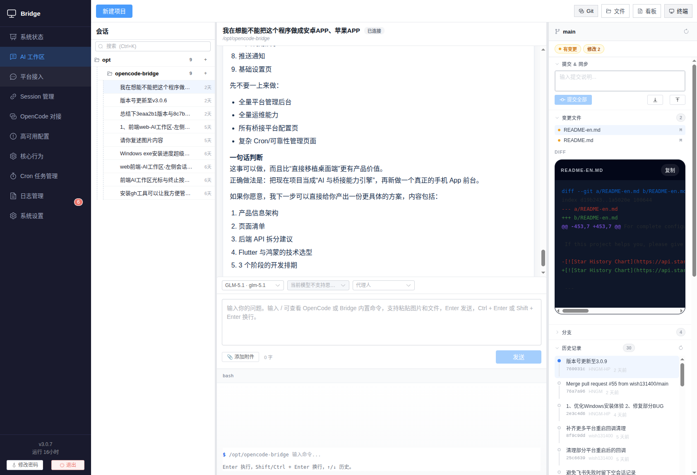
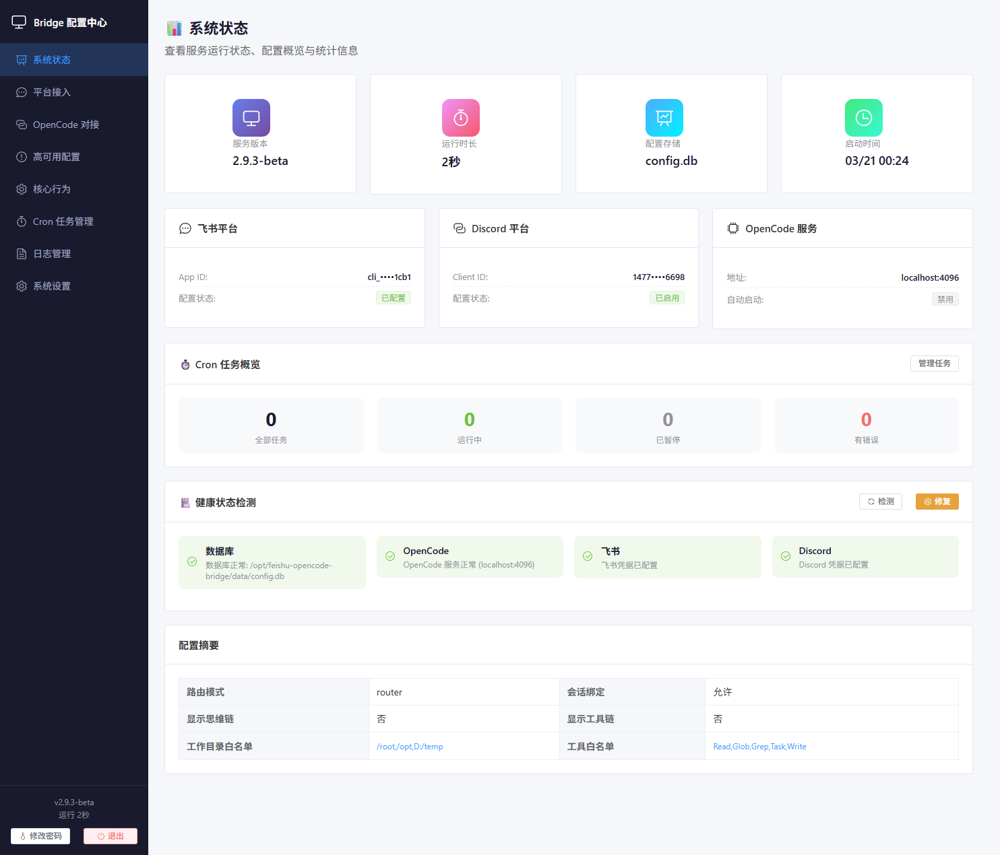
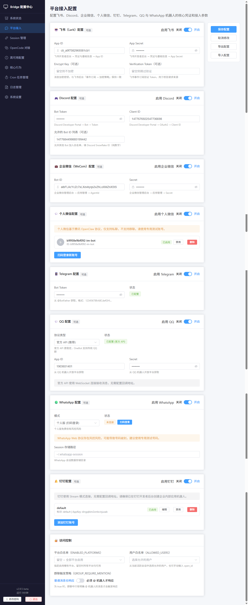
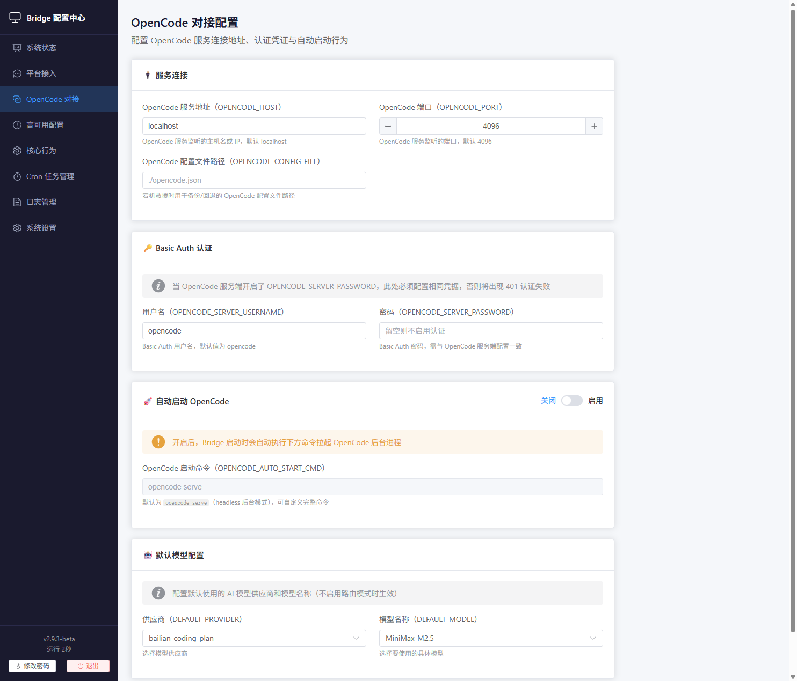
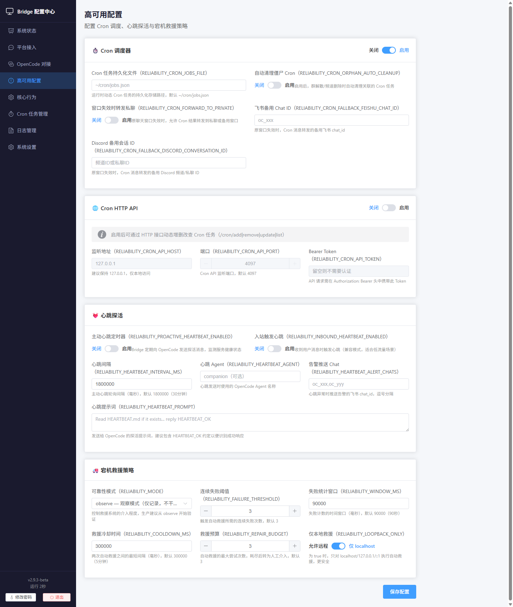
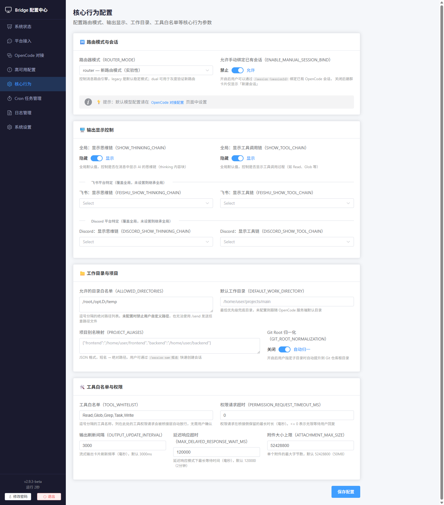
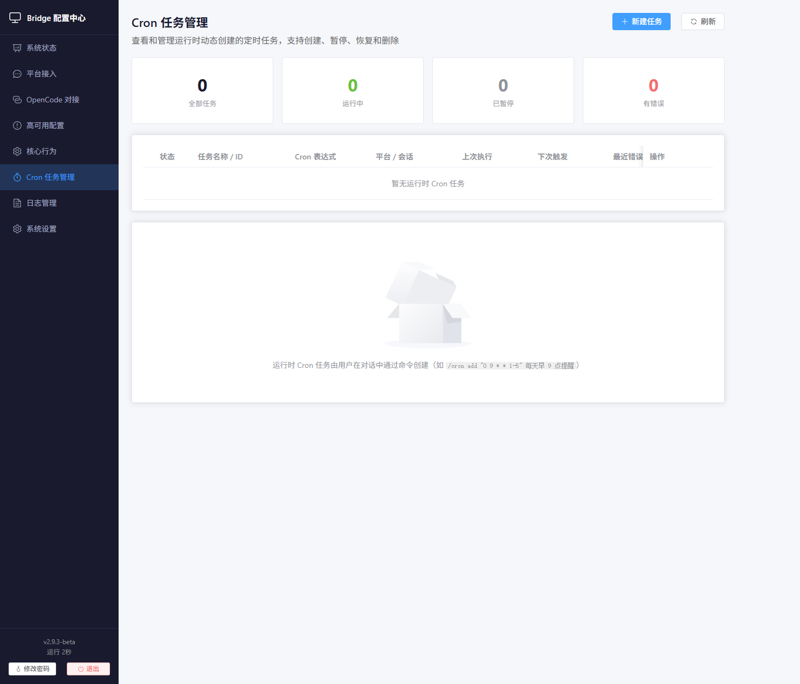
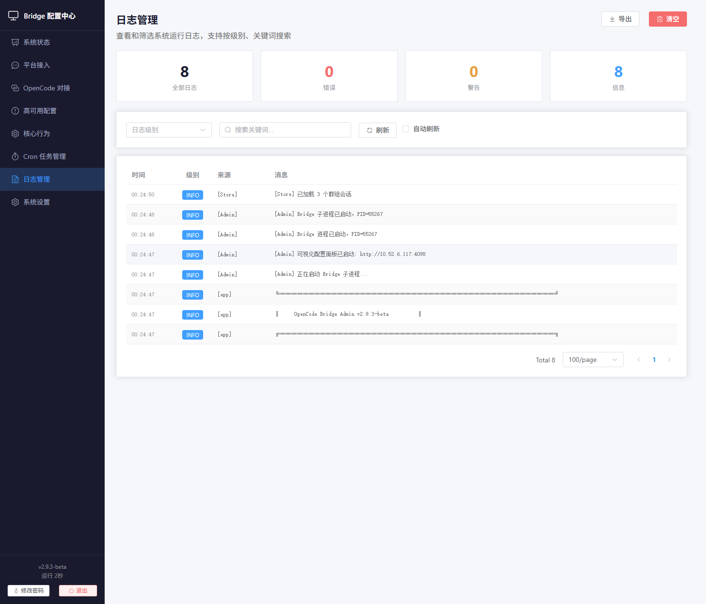
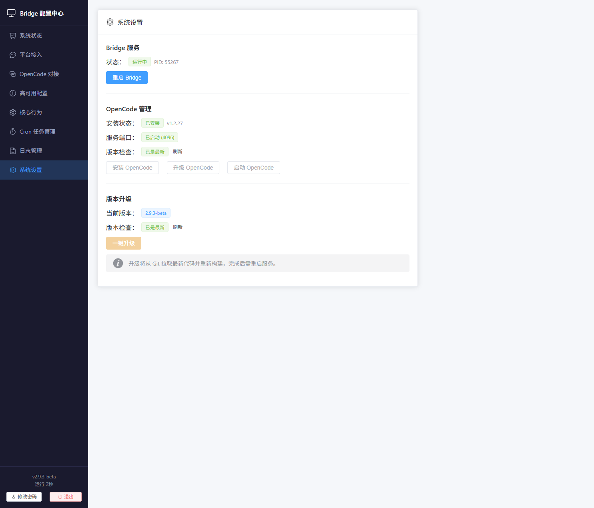
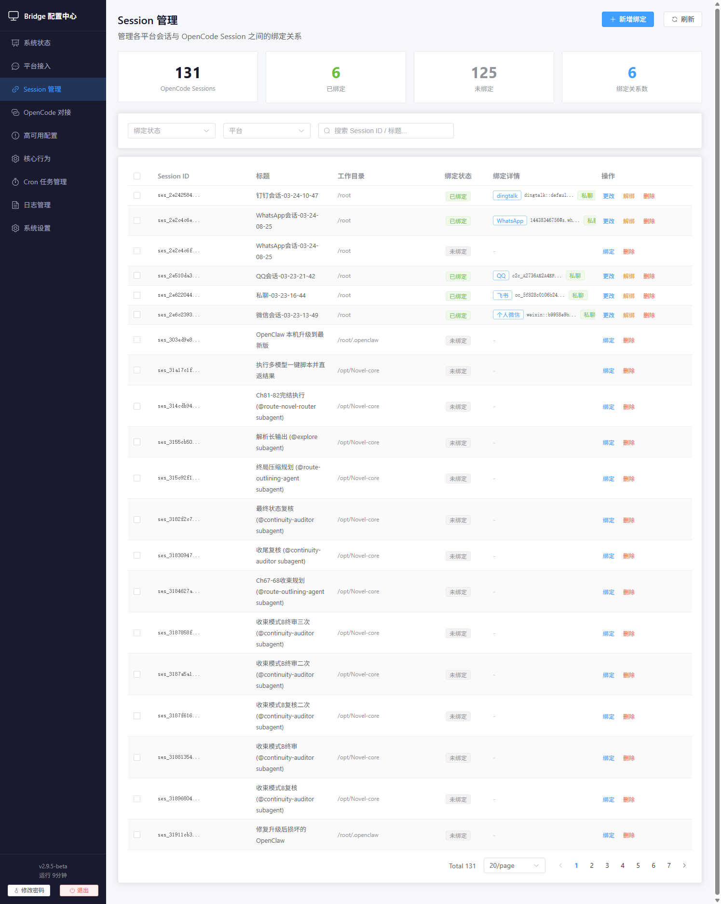

# OpenCode Bridge

[](https://github.com/HNGM-HP/opencode-bridge/blob/main)
[](https://nodejs.org/)
[](https://www.typescriptlang.org/)
[](https://www.gnu.org/licenses/gpl-3.0)

**[中文](./README.md) | [English](./README-en.md)**

---

> **OpenCode Bridge** 是一款将 OpenCode 的 AI 编程能力与智能对话能力无缝集成到主流即时通讯平台，实现跨平台、跨设备的一体化智能协作体验。

---

## 🎯 项目定位

**OpenCode Bridge** 不仅仅是一个简单的消息桥接工具，而是一个完整的 OpenCode 套壳应用：

- **🤖 AI 编程助手**：完整接入 OpenCode 的智能编程能力，支持代码生成、调试、重构等功能
- **💬 智能对话系统**：集成 Chat 能力，提供自然语言交互、知识问答、任务协助等对话式服务
- **🔌 全平台适配**：一套代码支持 8 大主流通讯平台，统一管理所有交互
- **⚙️ 程序化桥接**：深度集成 OpenCode SDK，实现会话管理、权限控制、文件传输等完整功能

与简单的消息转发不同，OpenCode Bridge 提供了完整的 OpenCode 体验套壳，让用户在任何平台上都能获得原生 OpenCode 的功能体验。

---

## 📱 支持平台

### 平台概览

| 平台 | 状态 | 接入方式 |
|------|------|----------|
| 飞书 (Lark) | ✅ 完整支持 | 机器人应用 |
| Discord | ✅ 完整支持 | Bot Token |
| 企业微信 (WeCom) | ✅ 完整支持 | 机器人应用 |
| Telegram | ✅ 完整支持 | Bot Token |
| QQ (OneBot) | ✅ 完整支持 | OneBot 协议 |
| WhatsApp | ✅ 完整支持 | 手机号配对 |
| 个人微信 | ✅ 完整支持 | 扫码登录 |
| 钉钉 (DingTalk) | ✅ 完整支持 | 机器人应用 |

### 功能支持对比

| 功能 | 飞书 | Discord | 企业微信 | Telegram | QQ | WhatsApp | 微信 | 钉钉 |
|------|------|---------|---------|---------|-----|---------|------|------|
| 文本消息 | ✅ | ✅ | ✅ | ✅ | ✅ | ✅ | ✅ | ✅ |
| 富媒体/卡片 | ✅ | ✅ | ❌ | ✅ | ❌ | ❌ | ❌ | ✅ |
| 流式输出 | ✅ | ✅ | ✅ | ✅ | ✅ | ✅ | ✅ | ✅ |
| 权限交互 | ✅ | ✅ | ✅ | ✅ | ✅ | ✅ | ✅ | ✅ |
| 文件传输 | ✅ | ✅ | ✅ | ✅ | ❌ | ✅ | ✅ | ✅ |
| 群聊支持 | ✅ | ✅ | ✅ | ✅ | ✅ | ✅ | ✅ | ✅ |
| 私聊支持 | ✅ | ✅ | ✅ | ✅ | ✅ | ✅ | ✅ | ✅ |
| 消息撤回 | ✅ | ✅ | ⚠️ | ✅ | ✅ | ✅ | ⚠️ | ✅ |
|
**> ⚠️ 部分支持说明**：企业微信、微信不支持撤回平台消息，但 `/undo` 命令可撤回 OpenCode 侧会话并发送提示消息。

---

## ✨ 核心特性

### 🔄 智能会话管理

- **独立会话绑定**：每个群聊/私聊独立绑定 OpenCode 会话，上下文互不干扰
- **会话迁移**：支持会话绑定、迁移与重命名，跨设备接力无缝衔接
- **多项目支持**：支持多项目目录切换及项目别名配置
- **自动清理**：自动回收无效会话，防止资源泄漏

### 🤖 AI 编程能力

- **智能代码生成**：支持多语言代码生成，实时语法高亮
- **代码调试与分析**：自动错误定位，提供修复建议
- **项目上下文理解**：基于完整项目代码库的智能分析
- **Shell 命令执行**：白名单命令可直接在聊天中执行
- **文件操作**：AI 可读写项目文件，支持代码重构

### 💬 智能对话系统

- **自然语言交互**：支持多轮对话，理解复杂语义
- **知识问答**：基于 OpenCode 知识库的智能问答
- **任务协助**：提供任务分解、步骤指导等辅助功能
- **上下文记忆**：跨会话的上下文保持与记忆管理

### 🔌 深度集成能力

- **流式输出**：实时显示 AI 响应，支持思维链可视化
- **权限交互**：AI 权限请求直接在聊天平台内完成确认
- **问题回答**：AI 提问可在聊天平台内直接作答
- **文件传输**：AI 可将文件或截图主动发送至聊天平台
- **多模态支持**：支持图片、文档等多种格式

### 🛡️ 可靠性保障

- **心跳监控**：定时探测 OpenCode 健康状态，及时感知异常
- **自动救援**：OpenCode 宕机时自动重启恢复，无需人工干预
- **Cron 任务**：支持运行时动态管理定时任务
- **日志审计**：完整的操作日志与错误追踪记录

### 🎛️ 三套配置入口（Web / TUI / 配置文件）

- **🌐 Web 管理面板**：浏览器可视化配置所有参数，平台 / Cron / 服务控制一站式
- **🧙 首次安装引导**：首次访问 Web 自动弹出向导（语言 → 选一个初始平台 → 基于 driver.js 的左侧菜单高亮气泡讲解），可跳过且不再打扰；右上角"帮助"菜单随时回看 README 与平台文档链接
- **💻 TUI 终端向导**：`opencode-bridge` / `opencode-bridge init` 在纯 CLI 环境下即可完成全部配置（中英双语，与 Web 共用同一份 SQLite 配置文件）
- **🔌 平台开关解耦**：可在 TUI 内单独关闭 Web 面板而保留接入平台运行（适合内网安全场景）
- **🆓 无登录无密码**：管理后台不再设置账号 / 密码，部署侧请通过防火墙 / 反向代理控制访问

---

<details>
<summary>🖼️ Web 可视化界面截图（点击展开）</summary>












</details>

---

## 🏗️ 架构概览

### 系统架构

```
┌─────────────────────────────────────────────────────┐
│                   📱 平台适配层                      │
│  飞书 | Discord | 企业微信 | Telegram | QQ |        │
│        WhatsApp | 微信 | 钉钉                        │
└──────────────────────┬──────────────────────────────┘
                       │ 统一消息格式
┌──────────────────────▼──────────────────────────────┐
│                   ⚙️ 核心处理层                      │
│  RootRouter → 会话管理 / 权限处理 / 问题作答         │
│              编程能力 / 对话能力 / 输出缓冲          │
└──────────────────────┬──────────────────────────────┘
                       │
┌──────────────────────▼──────────────────────────────┐
│                   🔗 集成层                          │
│              OpenCode Client SDK                     │
│         (编程接口 + 对话接口 + 会话管理)              │
└──────────────────────┬──────────────────────────────┘
                       │
┌──────────────────────▼──────────────────────────────┐
│                   🌐 OpenCode 核心                   │
│      AI 编程服务 | Chat 对话服务 | CLI 工具链         │
└─────────────────────────────────────────────────────┘
```

### 架构说明

| 层级 | 职责 | 关键组件 |
|------|------|----------|
| 📱 平台适配层 | 接收各平台消息，统一格式转换 | 8 个平台适配器 |
| ⚙️ 核心处理层 | 消息路由、会话管理、业务处理 | RootRouter、SessionManager、Permission、Question |
| 🔗 集成层 | 与 OpenCode 深度集成，完整功能调用 | OpencodeClient SDK (编程 + 对话) |
| 🌐 OpenCode 核心 | AI 服务、对话服务、工具链 | OpenCode 全功能服务 |

### 与传统桥接的区别

| 特性 | 传统消息桥接 | OpenCode Bridge |
|------|-------------|-----------------|
| 功能范围 | 消息转发 | 完整功能套壳 |
| 会话管理 | 简单映射 | 深度集成会话系统 |
| 能力支持 | 单一 AI | 编程 + 对话双能力 |
| 权限控制 | 无 | 完整权限交互体系 |
| 文件操作 | 无 | 支持文件读写传输 |
| 可扩展性 | 有限 | 支持插件化扩展 |

---

## 🚀 快速开始

### 桌面应用（Windows / macOS，推荐）

在 [GitHub Releases](https://github.com/HNGM-HP/opencode-bridge/releases) 下载对应安装包：

| 平台 | 安装包 | 说明 |
|------|--------|------|
| Windows | `.exe` | 双击安装，若提示"未识别应用"请选择"仍要运行" |
| macOS | `.dmg` | 拖拽至 Applications，首次启动请右键选择"打开" |

启动应用后会自动弹出浏览器到 `http://localhost:4098`，**首次访问会自动进入安装引导**：

1. 选择界面语言（中文 / English）
2. 选择一个先要接入的平台（也可跳过）
3. driver.js 风格的左侧菜单高亮逐项讲解（可跳过，后续不再显示）

引导完成后随时可在右上角的"帮助"菜单回看 README 与平台配置文档链接。

---

### NPM 安装部署（Linux / 服务器 / 无桌面环境）

```bash
npm install -g opencode-bridge
```

> 也可使用 `npx opencode-bridge` 免安装直接运行。

#### 子命令一览

| 命令 | 说明 |
|------|------|
| `opencode-bridge` | **首次运行**进入 TUI 交互式向导；**已配置**则直接启动桥接服务 |
| `opencode-bridge init` | 强制重新进入 TUI 向导（重新配置 / 修改任何项） |
| `opencode-bridge start` | 跳过向导，直接启动服务 |
| `opencode-bridge --config-dir /path` | 指定配置目录（默认 `./data`） |
| `opencode-bridge --version` / `--help` | 版本号 / 用法帮助 |

#### TUI 向导流程

1. **选择语言**（中文 / English，偏好持久化）
2. **选择配置方式**：
   - 在终端中通过 TUI 完成配置（推荐用于无桌面环境）
   - 启动 Web 管理面板，在浏览器中配置
   - 跳过配置，直接启动服务
   - 查看帮助 / 文档
3. **进入轮询主菜单**：选择初始接入平台 → 平台增删/凭据 → OpenCode 连接 → 群聊行为 / 白名单 → 可靠性 / Cron / 心跳 → 输出显示 → Web 管理面板启停 → 帮助 → 启动服务 / 退出

> TUI 与 Web 面板共用同一份 SQLite 配置（`data/config.db`），任意一侧修改对另一侧立即生效。

#### 仅启用平台不启用 Web 面板

在 TUI 的"Web 管理面板"菜单关闭，或临时通过环境变量：

```bash
BRIDGE_DISABLE_ADMIN=1 opencode-bridge start
```

适用于内网安全场景：平台适配器照常收发消息，但不暴露 Web 端口。

---

### 源码部署（开发者）

```bash
git clone https://github.com/HNGM-HP/opencode-bridge.git
cd opencode-bridge
```

#### 一键部署

**Linux / macOS：**

```bash
chmod +x ./scripts/deploy.sh
./scripts/deploy.sh
```

**Windows PowerShell：**

```powershell
.\scripts\deploy.ps1
```

部署脚本将自动完成：检测 Node.js / OpenCode → 安装依赖并编译 → 生成配置文件。

#### 启动服务

```bash
# Linux / macOS
./scripts/start.sh

# Windows PowerShell
.\scripts\start.ps1

# 开发模式
npm run dev
```

---

服务启动后，访问 Web 配置面板完成各平台接入配置：

```
http://localhost:4098
```

> 管理后台不再设置账号 / 密码，请确保 4098 端口仅在受信网络暴露，或通过反向代理 + 防火墙控制访问。

---

## ❓ 常见安装问题

### macOS 提示"已损坏"

**问题现象**：
```
"OpenCode Bridge" 已损坏，无法打开。你应该将它移到废纸篓。
```

**原因说明**：
- macOS 的安全机制（Gatekeeper）阻止了未签名的应用运行
- 本项目为开源免费项目，未购买 Apple Developer 证书进行签名

**解决方案**（任选其一）：

#### 方法 1：右键强制打开（推荐）
```
1. 右键点击 "OpenCode Bridge.app"
2. 按住键盘上的 "Option" 键
3. 双击 "打开" 按钮
4. 在弹出对话框中点击 "打开" 确认
```

#### 方法 2：系统设置解除限制
```
1. 打开 "系统设置" → "隐私与安全性"
2. 找到 "OpenCode Bridge 被阻止" 的提示
3. 点击 "仍要打开"
```

#### 方法 3：命令行移除隔离属性
```bash
# 在终端中执行（需要替换实际路径）
xattr -cr /Applications/OpenCode\ Bridge.app
```

**一次性操作后**，以后就可以正常双击启动了。

---

### Windows 提示"未识别的应用"

**问题现象**：
```
Windows 已保护你的电脑
Microsoft Defender SmartScreen 筛选器已阻止无法识别的应用启动
```

**解决方案**：
1. 点击 "更多信息"
2. 点击 "仍要运行"

**原因说明**：这是 Windows Defender 的正常保护机制，对无签名的应用都会提示。确认后即可正常运行。

---

### 应用启动后无法访问管理面板

**排查步骤**：

1. **检查应用是否运行**：
   - **Windows**：查看系统托盘（右下角）是否有 OpenCode Bridge 图标
   - **macOS**：查看顶部菜单栏是否有图标

2. **手动打开管理面板**：
   ```
   在浏览器中访问：http://localhost:4098
   ```

3. **检查端口占用**：
   ```bash
   # Windows PowerShell
   netstat -ano | findstr :4098
   
   # macOS/Linux
   lsof -i :4098
   ```

4. **检查 Web 是否被关闭**：在 TUI 中可手动关闭 Web 面板。如需重新打开，运行 `opencode-bridge init` 进入"Web 管理面板"菜单启用，或确认未设置 `WEB_ADMIN_DISABLED=true` / `BRIDGE_DISABLE_ADMIN=1`。

5. **查看日志文件**：
   - **Windows**：`%APPDATA%/opencode-bridge/logs/`
   - **macOS**：`~/Library/Application Support/opencode-bridge/logs/`

---

### 其他问题

如果遇到其他问题，请：
1. 查看 [故障排查文档](./assets/docs/troubleshooting.md)
2. 在 [GitHub Issues](https://github.com/HNGM-HP/opencode-bridge/issues) 搜索类似问题
3. 提交新的 Issue 并附上错误日志

---

## 📝 命令速查

### 通用命令（全平台可用）

| 命令 | 说明 |
|------|------|
| `/help` | 查看帮助 |
| `/status` | 查看当前状态 |
| `/panel` | 显示控制面板 |
| `/model` | 查看当前模型 |
| `/model <名称>` | 切换模型 |
| `/models` | 列出所有可用模型 |
| `/agent` | 查看当前角色 |
| `/agent <名称>` | 切换角色 |
| `/agents` | 列出所有可用角色 |
| `/effort` | 查看当前推理强度 |
| `/effort <档位>` | 设置推理强度 |
| `/session new` | 开启新话题 |
| `/sessions` | 列出会话 |
| `/undo` | 撤回上一轮交互 |
| `/stop` | 停止当前回答 |
| `/compact` | 压缩上下文 |
| `/rename <名称>` | 重命名会话 |
| `/project list` | 列出可用项目 |
| `/clear` | 重置对话上下文 |

### 飞书专属命令

| 命令 | 说明 |
|------|------|
| `/send <路径>` | 发送文件到群聊 |
| `/cron ...` | 管理 Cron 任务 |
| `/commands` | 生成命令清单文件 |
| `/create_chat` | 私聊中调出建群卡片 |
| `!<shell 命令>` | 透传 Shell 命令（白名单） |
| `//xxx` | 透传命名空间命令 |

### Discord 专属命令

| 命令 | 说明 |
|------|------|
| `///session` | 查看当前绑定的会话 |
| `///new` | 新建并绑定会话 |
| `///bind <sessionId>` | 绑定已有会话 |
| `///undo` | 撤回上一轮交互 |
| `///compact` | 压缩上下文 |
| `///workdir` | 设置工作目录 |
| `///cron ...` | 管理 Cron 任务 |

---

## 📚 文档导航

### 核心文档

| 文档 | 说明 |
|------|------|
| [架构设计](./assets/docs/architecture.md) | 项目分层设计与核心模块职责 |
| [配置中心](./assets/docs/environment.md) | 完整配置参数说明 |
| [部署运维](./assets/docs/deployment.md) | 部署、升级与 systemd 配置 |
| [命令速查](./assets/docs/commands.md) | 完整命令列表与使用说明 |
| [可靠性指南](./assets/docs/reliability.md) | 心跳、Cron 与宕机救援配置 |
| [故障排查](./assets/docs/troubleshooting.md) | 常见问题与解决方案 |

### 平台配置文档

| 文档 | 说明 |
|------|------|
| [飞书配置](./assets/docs/feishu-config.md) | 飞书事件订阅与权限配置 |
| [Discord 配置](./assets/docs/discord-config.md) | Discord 机器人配置指南 |
| [企业微信配置](./assets/docs/wecom-config.md) | 企业微信机器人配置指南 |
| [Telegram 配置](./assets/docs/telegram-config.md) | Telegram Bot 配置指南 |
| [QQ 配置](./assets/docs/qq-config.md) | QQ 官方 / OneBot 协议配置指南 |
| [WhatsApp 配置](./assets/docs/whatsapp-config.md) | WhatsApp Personal/Business 配置指南 |
| [微信个人号配置](./assets/docs/weixin-config.md) | 微信个人号配置指南 |
| [钉钉配置](./assets/docs/dingtalk-config.md) | 钉钉机器人 Stream 模式配置指南 |

### 扩展文档

| 文档 | 说明 |
|------|------|
| [Agent 使用](./assets/docs/agent.md) | 角色配置与自定义 Agent |
| [实现细节](./assets/docs/implementation.md) | 关键功能实现说明 |
| [SDK API](./assets/docs/sdk-api.md) | OpenCode SDK 集成指南 |
| [工作目录指南](./assets/docs/workspace-guide.md) | 工作目录策略与项目配置 |
| [灰度部署](./assets/docs/rollout.md) | 路由器模式灰度与回滚 |

---

## 📋 环境要求

| 依赖 | 版本要求 |
|------|----------|
| Node.js | >= 20.0.0 |
| 操作系统 | Linux / macOS / Windows |
| OpenCode | 需安装并运行 |

---

## 🔧 配置说明

### 配置管理方式

| 方式 | 说明 |
|------|------|
| Web 面板 | 访问 `http://localhost:4098` 进行可视化配置（推荐有 GUI 环境） |
| TUI 终端向导 | `opencode-bridge init` 进入轮询菜单，离线可用（推荐无 GUI 环境） |
| SQLite 数据库 | 配置存储于 `data/config.db`，Web / TUI 共用同一份 |
| `.env` 文件 | 仅作首次迁移来源；运行时配置以 SQLite 为准 |

### 核心配置项

| 配置项 | 默认值 | 说明 |
|--------|--------|------|
| `FEISHU_ENABLED` | `false` | 是否启用飞书适配器 |
| `DISCORD_ENABLED` | `false` | 是否启用 Discord 适配器 |
| `OPENCODE_HOST` | `localhost` | OpenCode 服务地址 |
| `OPENCODE_PORT` | `4096` | OpenCode 服务端口 |
| `ADMIN_PORT` | `4098` | Web 配置面板监听端口 |
| `WEB_ADMIN_DISABLED` | `false` | 设为 `true` 启动时不开 Web 面板（仅运行平台适配器） |
| `CLI_LANG` | `zh` / `en` | TUI 向导语言偏好（首次运行自动询问后保存） |

完整配置参数请参考 [配置中心文档](./assets/docs/environment.md)。

---

## 🌟 贡献与反馈

如果这个项目对你有帮助，欢迎点个 **Star** ⭐ 支持！

[](https://star-history.com/#HNGM-HP/opencode-bridge&Date)

---

## 📄 许可证

本项目采用 [GNU General Public License v3.0](./LICENSE)。

---

